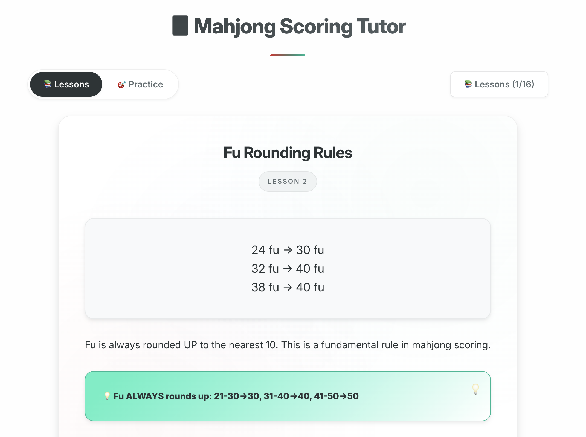

# 🀄 Mahjong Scoring Tutor

An interactive web application that teaches Japanese Mahjong scoring from the ground up. Learn fu, han, and point calculations through a structured lesson system with hands-on practice.

🚀 **Live Demo**: [https://skywardpixel.github.io/mahjong-scoring-tutor/](https://skywardpixel.github.io/mahjong-scoring-tutor/)



## 🎯 Features

### 📚 Comprehensive Lesson System
- **Comprehensive structured lessons** covering all scoring fundamentals
- **Progressive difficulty** from basic concepts to advanced calculations
- **Interactive quizzes** with immediate feedback
- **Visual tile displays** with custom SVG graphics
- **Progress tracking** with lesson unlocking system

### 🧮 Core Topics Covered
- **Fu calculation** - Base points and rounding rules
- **Han system** - Yaku recognition and counting
- **Scoring formula** - `fu × 2^han = base points`
- **Payment structures** - Ron vs Tsumo differences
- **Riichi mechanics** - Cost, bonus collection, and strategy
- **Theory vs Practice** - Formula calculations vs real-world payment tables
- **Comprehensive Dora System** - All dora types, mechanics, and integration

### 🎯 Practice Mode
- **Algorithmic hand generation** - Truly random hands, not presets
- **Complete scoring practice** - Calculate fu, han, and base points
- **Detailed explanations** - Learn from mistakes with step-by-step breakdowns
- **Score tracking** - Monitor your progress and accuracy

### 🎨 Modern Design
- **2025-inspired UI** with mahjong-themed color palette
- **Responsive design** for desktop and mobile
- **Smooth animations** and professional styling
- **Consistent design system** with comprehensive CSS variables

## 🚀 Getting Started

### Prerequisites
- Node.js (v14 or higher)
- npm or yarn package manager

### Installation

1. **Clone the repository**
   ```bash
   git clone https://github.com/skywardpixel/mahjong-scoring-tutor.git
   cd mahjong-scoring-tutor
   ```

2. **Install dependencies**
   ```bash
   npm install
   ```

3. **Start the development server**
   ```bash
   npm run dev
   ```

4. **Open your browser**
   Navigate to `http://localhost:5173`

### Build for Production
```bash
npm run build
npm run preview
```

### Run Tests
```bash
# Run tests in watch mode
npm test

# Run tests once
npm run test:run

# Run tests with UI
npm run test:ui

# Run tests with coverage
npm run test:coverage
```

## 🎓 Learning Path

### Beginner Track (Lessons 1-6)
- Introduction to fu and han concepts
- Basic calculation formulas
- Fundamental scoring principles

### Intermediate Track (Lessons 7-12)
- Point transfer mechanics
- Complete hand calculations
- Practical examples and edge cases

### Advanced Track (Lessons 13-20)
- Riichi system mechanics
- Theory vs real-world applications
- Complete scoring scenarios
- Introduction to dora system

### Expert Track (Advanced Lessons)
- Ura dora mechanics and timing
- Kan dora rules and interactions
- Multiple dora scenarios
- Complete dora integration with scoring
- Advanced practical examples

## 🛠️ Technology Stack

- **Frontend**: React 18 + Vite
- **Styling**: Pure CSS with custom properties
- **State Management**: React Hooks + localStorage
- **Testing**: Vitest + Testing Library
- **Build Tool**: Vite
- **Graphics**: Custom SVG tile system

## 📱 Browser Support

- Chrome/Edge 88+
- Firefox 85+  
- Safari 14+
- Mobile browsers (iOS Safari, Chrome Mobile)

## 🎮 How to Use

### Lesson Mode
1. Start with lesson 1 and progress sequentially
2. Read each concept explanation carefully
3. Complete the interactive quiz to unlock the next lesson
4. Use the lesson selector to review completed lessons

### Practice Mode  
1. Switch to Practice mode from the top navigation
2. Analyze the randomly generated hand
3. Calculate fu, han, and base points
4. Submit your answers for immediate feedback
5. Study the detailed explanation to improve

## 🤝 Contributing

We welcome contributions! Here are ways to help:

### Reporting Issues
- Bug reports with steps to reproduce
- Educational content corrections
- UI/UX improvement suggestions

### Development
1. Fork the repository
2. Create a feature branch (`git checkout -b feature/amazing-feature`)
3. Make your changes
4. Test thoroughly
5. Commit with clear messages (`git commit -m 'Add amazing feature'`)
6. Push to your branch (`git push origin feature/amazing-feature`)
7. Open a Pull Request

### Educational Content
- Review lessons for accuracy
- Suggest additional examples
- Report confusing explanations
- Contribute new practice scenarios

## 📋 Development Guidelines

### Code Style
- Use functional components with hooks
- Follow the established design system (see `DESIGN.md`)
- Maintain consistent naming conventions
- Add comments for complex calculations

### Educational Standards
- All scoring calculations must be mathematically accurate
- Examples should reflect real mahjong scenarios
- Lessons should build knowledge progressively
- Quiz questions must have unambiguous correct answers

## 🔄 Project Structure

```
src/
├── components/          # React components
│   ├── Lesson.jsx      # Individual lesson display
│   ├── Quiz.jsx        # Interactive quiz component
│   ├── PracticeMode.jsx # Scoring practice interface
│   └── ...
├── lessons/            # Lesson content and data
│   └── lessonData.js   # All lesson definitions
├── utils/              # Utility functions
│   └── handGenerator.js # Random hand generation
├── hooks/              # Custom React hooks
│   └── useLocalStorage.js # Persistent storage
└── index.css           # Global styles and design system
```

## 🚀 Deployment

The application is automatically deployed to GitHub Pages using GitHub Actions.

### Automatic Deployment
- **Trigger**: Push to `main` branch
- **Process**: Build → Test → Deploy
- **URL**: https://skywardpixel.github.io/mahjong-scoring-tutor/

### Manual Deployment
```bash
npm run build
# Upload dist/ folder to your hosting provider
```

### Development Build
```bash
npm run dev          # Start development server
npm run build        # Build for production
npm run preview      # Preview production build
```

## 🎯 Roadmap

### Phase 1 (Current)
- ✅ Complete lesson system with comprehensive dora coverage
- ✅ Comprehensive dora education
- ✅ Practice mode with random hands
- ✅ Modern responsive design
- ✅ Progress tracking

### Phase 2 (Planned)
- [ ] Additional yaku lessons
- [ ] Multiplayer scoring practice
- [ ] Advanced payment table integration
- [ ] Mobile app version

### Phase 3 (Future)
- [ ] Video explanations
- [ ] Community features
- [ ] Tournament scoring modes
- [ ] Multilingual support

## 📄 License

This project is licensed under the MIT License - see the [LICENSE](LICENSE) file for details.

## 🙏 Acknowledgments

- Inspired by the need for better mahjong education tools
- Thanks to the mahjong community for feedback and testing
- Special appreciation for educational accuracy reviewers

## 📞 Support

- **Issues**: [GitHub Issues](https://github.com/skywardpixel/mahjong-scoring-tutor/issues)
- **Discussions**: [GitHub Discussions](https://github.com/skywardpixel/mahjong-scoring-tutor/discussions)

---

**Start your mahjong scoring journey today!** 🀄✨

*Learn the fundamentals, master the calculations, and bridge the gap between theory and practice.*